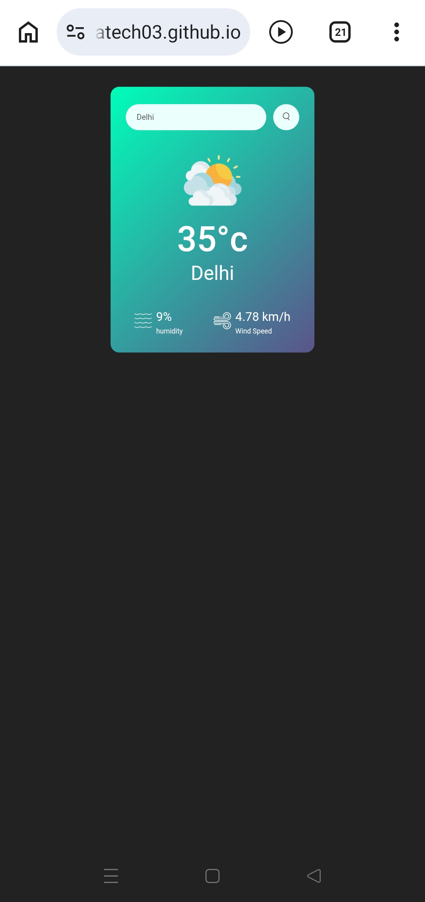

# 🌦️ Weather App

A modern and responsive **Weather Application** built using **HTML, CSS, and JavaScript** that allows users to check real-time weather conditions of any city in the world.

This project fetches live weather data and displays important weather details such as **temperature, humidity, wind speed, and weather condition icons**.

---

## 🚀 Live Demo

**👉 [Show Project]**(https://mdrajatech03.github.io/Wheather-App/)

---

## 📌 Features

- 🌍 Search weather by city name
- 🌡️ Displays real-time temperature
- 💧 Shows humidity level
- 🌬️ Displays wind speed
- ☁️ Dynamic weather icons (Clouds, Rain, Snow, Mist, etc.)
- 📱 Responsive design for mobile and desktop
- ⚡ Fast and lightweight interface

---

## 🛠️ Technologies Used

- HTML5
- CSS3
- JavaScript
- Weather API

---

## 📂 Project Structure

Weather-App │ ├── index.html ├── style.css ├── clear.png ├── clouds.png ├── drizzle.png ├── humidity.png ├── mist.png ├── rain.png ├── search.png ├── snow.png ├── wind.png └── README.md

---

## ⚙️ How to Use

1. Clone the repository
   
   git clone https://github.com/mdrajatech03/Weather-App.git�

3. pen the project folder
   
   cd Weather-App
   
4. Run the project

Simply open **index.html** in your browser.

---

## 📸 Screenshot

---

## 🎯 Future Improvements

- Add location-based weather detection
- Add 5-day weather forecast
- Improve UI animations
- Dark/Light mode support

---

## 👨‍💻 Author

**Md Raja**

GitHub: https://github.com/mdrajatech03

---

## 📜 License

This project is licensed under the **MIT License**.
